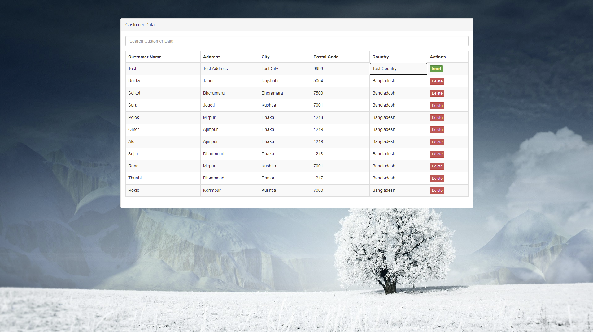
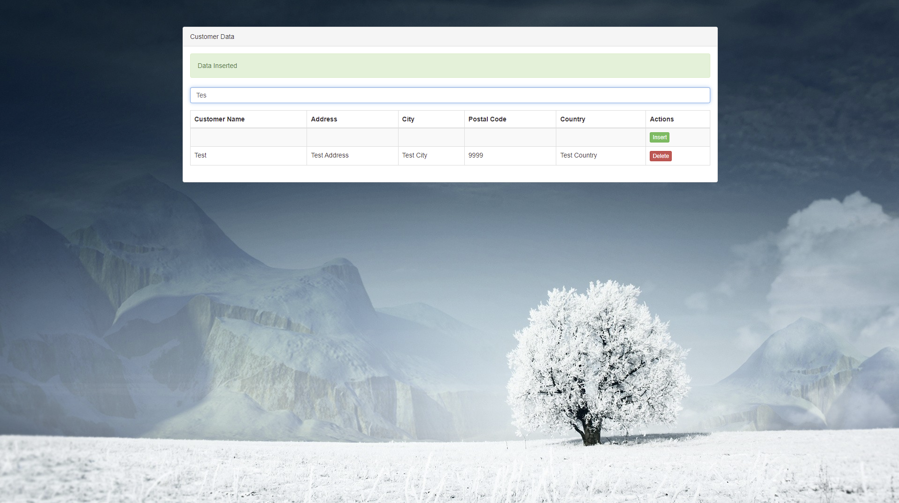

<!-- ABOUT THE PROJECT -->
## About The Project
This Laravel project helps you to develop a blog with Live insert, update, delete, and search operation with ajax
and MySQL database. 

## Features

	- Live Insert
	- Live Inline Update
	- Live Delete
	- Live Search with keyword

## Content Delivery Network 

	
    	<link rel="stylesheet" href="https://maxcdn.bootstrapcdn.com/bootstrap/3.3.6/css/bootstrap.min.css" />
    	

## Output
Here is the expected output!

